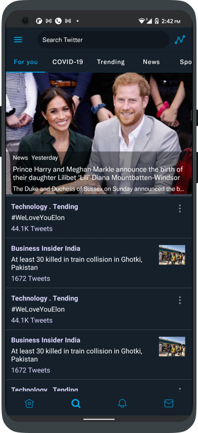
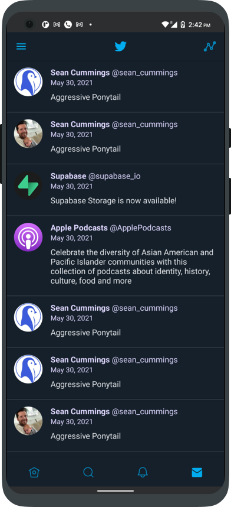
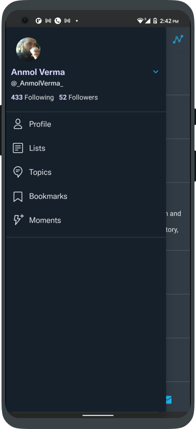
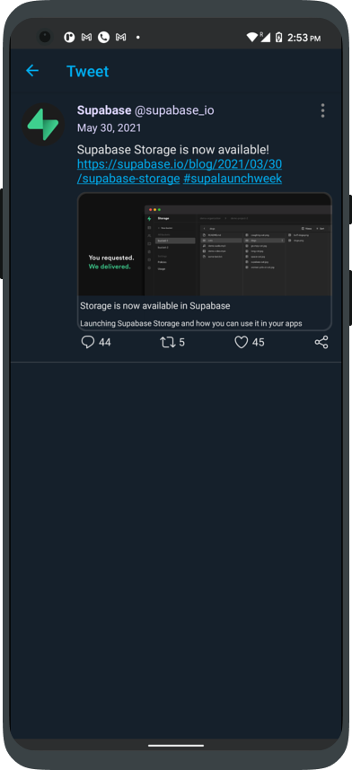

# Jettwitter

A clone of Twitter app in Android built using Jetpack compose.

    

 

### Submission for Compose Hackathon.

Note: This project is only for learning purposes, I do not in anyway want to promote anything that breaks the laws/piracy etc.!

Functionality:
* Recreated the UI for the basic twitter mobile app UI elements
* Used Dagger Hilt for the first time.
* Home Screen With Stories List
* Search Screen
* Notifications Screen
* Messages Screen

Scaffold
* Side Navigation Menu
* Bottom Bar
* Top AppBar
* Navigation with backstack management
* Hashtag and url recogniser in the tweet to load the metadata using HTML embed.
* Tweet Details screen

Although much more is pending but overall I loved writing UI with Jetpack compose!

### Screens
Home Tab             |  Search Tab | Notifications Tab
:-------------------------:|:-------------------------: | :-------------------------: 
  |   | 

Messages Tab             |  Side Navigation | Tweet Details
:-------------------------:|:-------------------------: | :-------------------------: 
  |   | 

### Status: 🚧 In progress

Jettwitter is still under development and more screens will be added.

### Libraries used

* [Jetpack Compose]
* [Accompanist]
* [Coroutines]
* [Compose Navigation]

[Jetpack Compose]: https://developer.android.com/jetpack/compose
[Accompanist]: https://github.com/chrisbanes/accompanist
[Coroutines]: https://developer.android.com/kotlin/coroutines
[Compose Navigation]: https://developer.android.com/jetpack/compose/navigation
